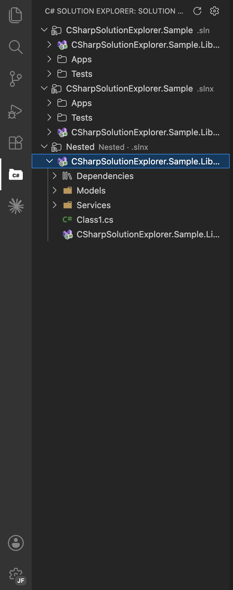
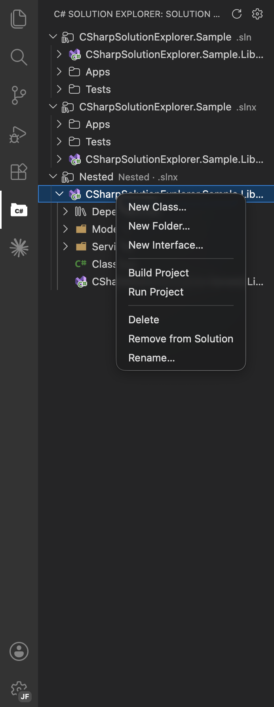

# C# Solution Explorer

A lightweight Solution Explorer for C# projects in VS Code — and in Open VSX-compatible editors such as VSCodium.





## Vision

The long-term goal is a VS Code extension that gives C# (and Razor) developers everything they need to write and debug their code, without depending on Microsoft-proprietary-only extensions (like C# Dev Kit) that aren't available on Open VSX. That full scope — language features, IntelliSense, debugging — is **not** part of this version.

## Features

- Dedicated Activity Bar view showing `Solution → Solution Folders → Projects → Folders/Files`.
- Parses `.sln` and `.slnx` solution files, including Solution Folder nesting.
- Falls back to a loose top-level `.csproj` when no solution file is found.
- Folders and files are read directly from disk (no MSBuild evaluation), excluding `bin`, `obj`, `node_modules`, and hidden directories.
- Per-project **Dependencies** tree grouped into Visual Studio-style categories (Frameworks, Analyzers, Packages, Projects), with full NuGet and project-reference management — see [Dependencies](#dependencies).
- **File nesting** groups related files under a parent, like Visual Studio: `appsettings.*.json` under `appsettings.json`, `.xaml.cs` under `.xaml`, `.Designer.cs`/`.cs` under `.resx`, `*.min.css`/`*.min.js` under their source, and `.razor` companions under the component. Toggle with `csharpSolutionExplorer.fileNesting.enabled`.
- Manual refresh button and automatic refresh via a file system watcher.
- Click a file to open it in the editor.

### Context menu commands

| Command                  | Available on                           |
| ------------------------ | -------------------------------------- |
| New Item ▶               | Project, Folder                        |
| — New Class…             | Project, Folder                        |
| — New Interface…         | Project, Folder                        |
| — New Record…            | Project, Folder                        |
| — New Enum…              | Project, Folder                        |
| — New Struct…            | Project, Folder                        |
| — New Razor Component…   | Project, Folder                        |
| — New File…              | Project, Folder                        |
| New Folder…              | Project, Folder                        |
| New Solution Folder…     | Solution, Solution Folder              |
| New Project…             | Solution, Solution Folder              |
| Add Existing Project…    | Solution, Solution Folder              |
| Add Project Reference…   | Project, Dependencies, Projects        |
| Remove (reference)       | Project reference                      |
| Add Package…             | Project, Dependencies, Packages        |
| Update Package…          | Package                                |
| Update to Latest Version | Outdated package                       |
| Remove Package           | Package                                |
| Build                    | Project, Solution                      |
| Rebuild                  | Project, Solution                      |
| Run Project              | Project                                |
| Test                     | Project, Solution                      |
| Restore                  | Project, Solution                      |
| Clean                    | Project, Solution                      |
| Rename…                  | Project, Solution Folder, Folder, File |
| Delete                   | Project, Solution Folder, Folder, File |
| Remove from Solution     | Project                                |
| Open in Editor           | Project, Solution node                 |

- **New Item submenu**: prompts for a name and creates the file in the target folder. The namespace is derived automatically from the project name and folder path. All templates are configurable — see [Settings](#settings) below.
- **New Razor Component…**: enforces the Blazor convention that component names start with an uppercase letter.
- **New File…**: accepts any filename with extension and creates an empty file.
- **Rename**: updates the solution file entry and root folder when renaming a project or Solution Folder.
- **Delete**: moves files and folders to trash; removes the project or Solution Folder entry from the solution file.
- **Remove from Solution**: removes the project reference from the solution file without deleting files on disk.
- **New Project…**: scaffolds a new project from a `dotnet new` template (Console, Class Library, Web API, Blazor, test projects, and more), creates it in a folder next to the solution, and registers it in the `.sln`/`.slnx` file.
- **Build / Rebuild / Run / Test / Restore / Clean**: runs the matching `dotnet` command in a dedicated VS Code terminal. Build, Rebuild, Test, Restore, and Clean work on both project and solution nodes; Run is project-only. **Rebuild** uses `dotnet build --no-incremental` to force a full recompile.
- **Open in Editor**: opens the raw `.sln`/`.slnx` (on a solution) or `.csproj` (on a project) file in the editor. The project's own `.csproj` is not listed as a child file — use this command to open it.

### Dependencies

Each project has a **Dependencies** node that mirrors Visual Studio, grouping references into **Frameworks**, **Analyzers**, **Packages**, and **Projects** (empty categories are hidden). It is resolved from `project.assets.json` after a restore — so it reflects exactly what was restored, including transitive packages — and falls back to reading the `.csproj` directly when no restore has run.

- **NuGet packages**: **Add Package…** opens a Quick Pick that searches nuget.org live as you type, followed by a version pick. Direct packages offer **Update Package…** (pick any version) and **Remove Package**. All writes go through the `dotnet` CLI, so versions resolve and a restore keeps the tree in sync.
- **Outdated packages**: when `csharpSolutionExplorer.nuget.checkForUpdates` is enabled (default), expanding the **Packages** node checks nuget.org for newer stable versions. Outdated direct packages are highlighted as `installed → latest` with an **Update to Latest Version** one-click action. Results are cached for the session.
- **Project references**: **Add Project Reference…** lets you select one or more other projects to reference; **Remove** drops a direct reference. Each reference can be expanded to reveal the referenced project's own references — fully recursive, dimmed, with cycle protection.

### Drag and drop

Projects can be dragged between Solution Folders (or to the solution root) directly in the tree.

### Settings

| Setting                                        | Default       | Description                                                                   |
| ---------------------------------------------- | ------------- | ----------------------------------------------------------------------------- |
| `csharpSolutionExplorer.confirmMove`           | `true`        | Show a confirmation dialog before a drag-and-drop move.                       |
| `csharpSolutionExplorer.nuget.checkForUpdates` | `true`        | Check nuget.org for newer versions of direct packages and flag outdated ones. |
| `csharpSolutionExplorer.fileNesting.enabled`   | `true`        | Group related files under a parent (e.g. `appsettings.*.json`, `.xaml.cs`).   |
| `csharpSolutionExplorer.templates.class`       | *(see below)* | Template for new C# class files.                                              |
| `csharpSolutionExplorer.templates.interface`   | *(see below)* | Template for new C# interface files.                                          |
| `csharpSolutionExplorer.templates.record`      | *(see below)* | Template for new C# record files.                                             |
| `csharpSolutionExplorer.templates.enum`        | *(see below)* | Template for new C# enum files.                                               |
| `csharpSolutionExplorer.templates.struct`      | *(see below)* | Template for new C# struct files.                                             |
| `csharpSolutionExplorer.templates.razor`       | *(see below)* | Template for new Razor component files.                                       |

All template settings support the following variables:

| Variable       | Replaced with                                       |
| -------------- | --------------------------------------------------- |
| `${namespace}` | Namespace derived from project name and folder path |
| `${name}`      | Type or component name entered by the user          |
| `${filename}`  | Full filename including extension                   |
| `${date}`      | Today's date in `YYYY-MM-DD` format                 |
| `${cursor}`    | Initial cursor position after the file is opened    |

Clearing a template setting causes an error to be shown instead of creating the file, which lets you disable individual item types. The default values can be restored with the reset icon in VS Code Settings.

The gear icon in the view title opens the extension settings directly.

## Requirements

- **VS Code ≥ 1.85** (or a compatible Open VSX editor).
- **.NET CLI** (`dotnet`) must be on your `PATH` for the Build, Rebuild, Run, Test, Restore, Clean, New Project, and NuGet package commands (Add/Update/Remove Package).
- **Internet access** to nuget.org is needed for the package search and the outdated-package check (both can be ignored if you only manage references offline).

## Development

```bash
npm install
```

Press `F5` in VS Code to launch the Extension Development Host with the sample solution (`samples/CSharpSolutionExplorer.Sample`) already open.

```bash
npm run lint
npm run check-types
npm test
```

## License

[MIT](LICENSE)
