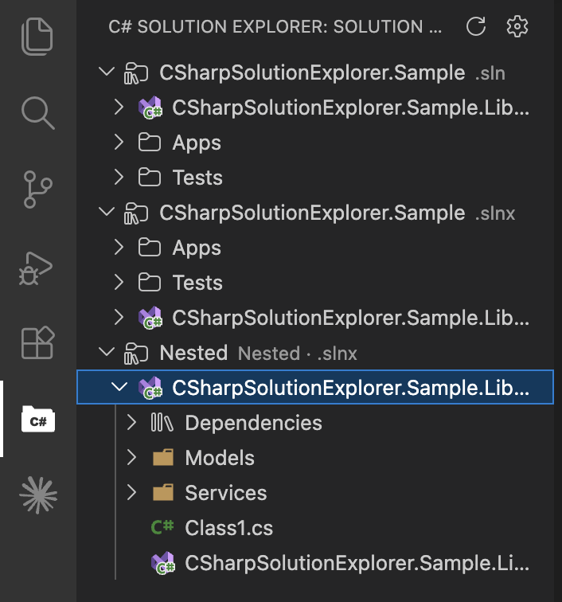
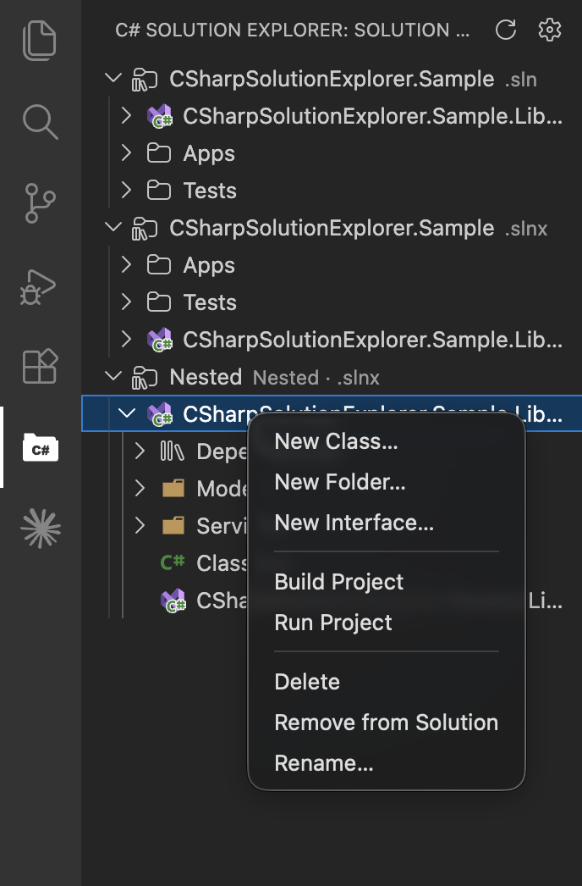

# C# Solution Explorer

[](https://open-vsx.org/extension/jomblebee/jomblebee-csharp-solution-explorer)
[](https://marketplace.visualstudio.com/items?itemName=jomblebee.jomblebee-csharp-solution-explorer)
[](https://code.visualstudio.com/)
[](LICENSE)

A C# Solution Explorer for VS Code — and Open VSX-compatible editors such as VSCodium — with an **optional bundled Roslyn language server**, so you can get IntelliSense without any Microsoft-proprietary extension.





## Vision

The long-term goal is a VS Code extension that gives C# (and Razor) developers everything they need to write and debug their code, without depending on Microsoft-proprietary-only extensions (like C# Dev Kit) that aren't available on Open VSX. As a step toward that, this version can now host its **own C# language server** (Roslyn) for IntelliSense, with Razor cohosting **on by default** — see [C# Language Server](docs/language-server.md). Razor **debugging** is still **not** part of this version.

## Features

- Dedicated Activity Bar view showing `Solution → Solution Folders → Projects → Folders/Files`.
- Parses `.sln` and `.slnx` solution files, including Solution Folder nesting; falls back to a loose top-level `.csproj` when no solution file is found.
- Per-project **Dependencies** tree grouped into Visual Studio-style categories (Frameworks, Analyzers, Packages, Projects), with full NuGet and project-reference management — see [Dependencies & NuGet](docs/nuget.md).
- **NuGet Package Manager** panel with Browse / Installed / Updates / Consolidate tabs over a solution-wide project checklist, package READMEs, and deprecation and vulnerability badges — see [NuGet Package Manager](docs/nuget.md#nuget-package-manager).
- **C# debugging (F5)** via a bundled netcoredbg debugger — no Microsoft-proprietary extension required — with launch profiles from `launchSettings.json`, startup project selection, and a real console via **Debug Startup Project in External Terminal** — see [Debugging](docs/debugging.md).
- **Test Explorer** in VS Code's native Testing view: tests discovered per project, run or debug down to a single test method, live results, and **Run with Coverage** with per-line highlighting — see [Test Explorer](docs/test-explorer.md).
- **New Item templates**, project scaffolding via `dotnet new`, Build / Rebuild / Run / Test / Restore / Clean, rename, delete, and solution file management — see [Commands](docs/commands.md).
- **File nesting** groups related files under a parent, like Visual Studio (`appsettings.*.json`, `.xaml.cs`, `.Designer.cs`, `.razor` companions). Toggle with `csharpSolutionExplorer.fileNesting.enabled`.
- **Auto-sync**: the active editor's file is selected (and its parents expanded) in the tree automatically — plus **Show in Solution Explorer** on demand.
- **Copy / Cut / Paste** files and folders between folders and projects, and **drag and drop** projects between Solution Folders.
- Manual refresh button and automatic refresh via a file system watcher.

## Debugging

Press `F5` to build and debug the startup project directly — no `launch.json`, no debugger picker. The extension brings its own debugger, [netcoredbg](https://github.com/Samsung/netcoredbg) (Samsung, MIT), and reads launch profiles straight from `Properties/launchSettings.json`. Startup project and launch profile each live in their own status bar item; **Debug Startup Project in External Terminal** gives the program a real console for interactive input.

**[Debugging in detail →](docs/debugging.md)** — F5 takeover rules, external terminal flow, netcoredbg's known limits.

## Test Explorer

C# test projects appear in VS Code's native **Testing** view. Run or debug a whole project, a class, or a single test method — including data-driven cases, which nest under their method — with results, failure messages and clickable stack frames reported per test, and play icons in the editor gutter. **Run with Coverage** collects line coverage and highlights it in the editor; the extension offers to add the coverage package a project is missing.

**[Test Explorer in detail →](docs/test-explorer.md)** — Microsoft.Testing.Platform vs. classic VSTest, single-test debugging, coverage packages, known limits.

## Dependencies & NuGet

Every project gets a Visual Studio-style **Dependencies** tree with live outdated-package checks, and **Manage NuGet Packages…** opens a solution-wide panel mirroring Visual Studio's "Manage Packages for Solution" — including Central Package Management support.

**[Dependencies & NuGet in detail →](docs/nuget.md)**

## C# Language Server (experimental)

The extension can host the open-source **Roslyn** language server itself: IntelliSense, diagnostics, hover, go-to-definition for C# — and Razor language features via cohosting, on by default. It stays off automatically when the Microsoft C# extension is installed.

**[C# Language Server in detail →](docs/language-server.md)**

## Commands & Settings

Every context menu command and where it appears: **[Commands](docs/commands.md)**.
All `csharpSolutionExplorer.*` options and the New Item template variables: **[Settings](docs/settings.md)**.

## Requirements

- **VS Code ≥ 1.91** (or a compatible Open VSX editor) — the Test Explorer's coverage API needs 1.88, the bundled language client 1.91.
- **.NET CLI** (`dotnet`) must be on your `PATH` for the Build, Rebuild, Run, Test, Restore, Clean, New Project, and NuGet package commands (Add/Update/Remove Package, and the NuGet Package Manager panel).
- A **.NET runtime** is required to run the bundled C# language server (the `dotnet` SDK above provides one). The downloaded server is ReadyToRun but framework-dependent, not self-contained.
- **Internet access** is needed on first use of the language server (to download it from the Roslyn language server feed) and to nuget.org for package search, package details and README, and the outdated-package check. All are optional — set `csharpSolutionExplorer.languageServer.serverPath` to run the server fully offline.

## Development

```bash
npm install
```

Press `F5` in VS Code to launch the Extension Development Host with the sample solution (`samples/TaskFlow`) already open.

```bash
npm run lint
npm run check-types
npm test
```

Setup details, the test layout and the commit convention are in [CONTRIBUTING.md](CONTRIBUTING.md).

## License

[MIT](LICENSE)

Third-party components — the vendored TextMate grammars, the bundled npm dependencies and
the language server and debugger downloaded at runtime — are listed with their licenses in
[THIRD_PARTY_NOTICES.md](THIRD_PARTY_NOTICES.md). All of them are permissive open source
(MIT, ISC, Blue Oak); nothing copyleft is bundled or downloaded.
